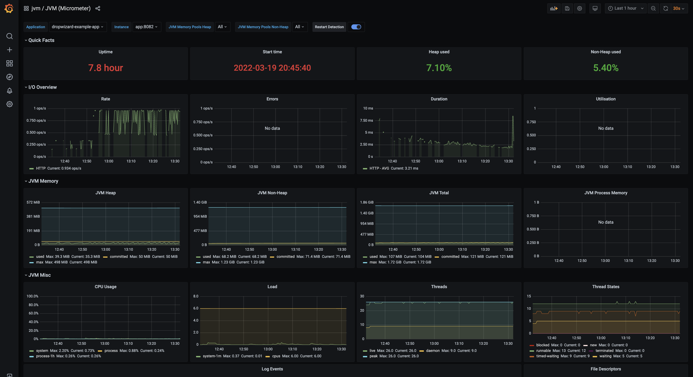
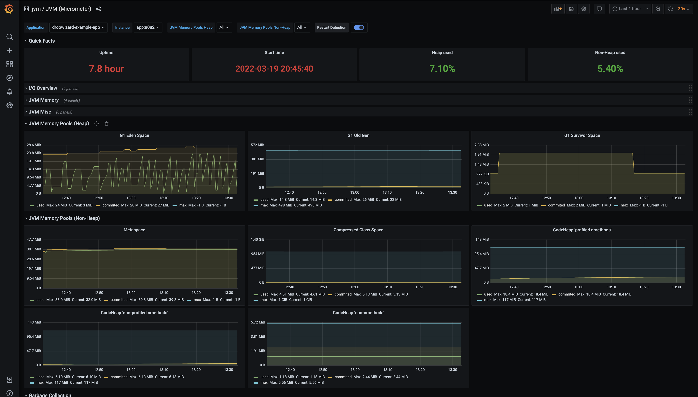
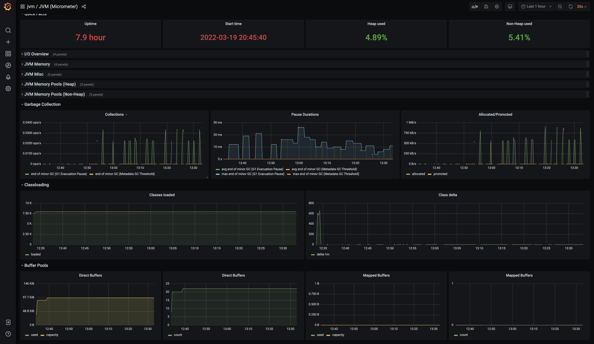
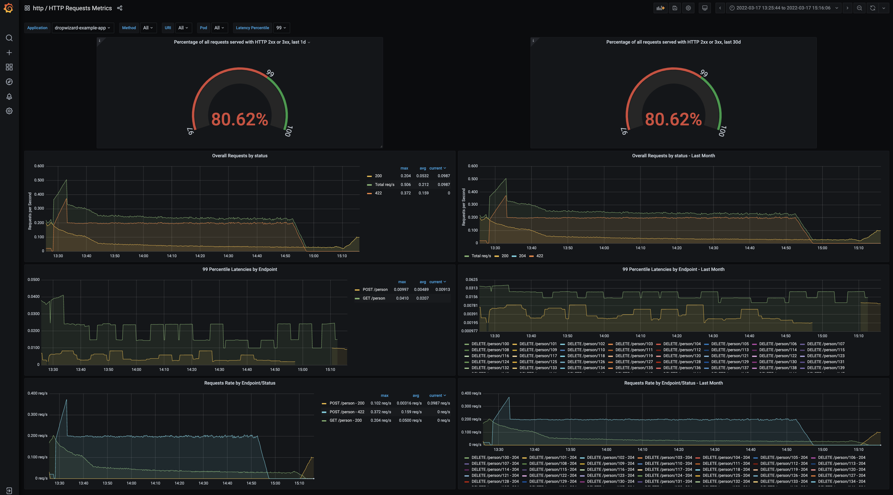
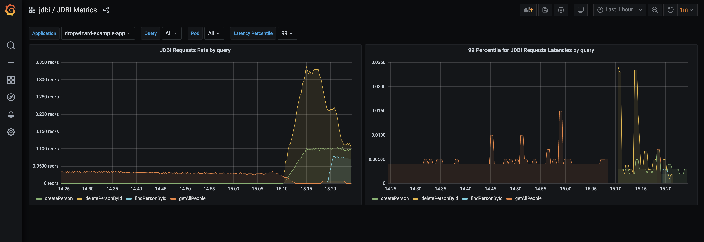

# Overview
This example app provides a way to start the whole stack to test dropwizard-micrometer integration 
with docker-compose (the complete stack contains app, database, prometheus, grafana).
To start the stack:
```shell
docker-compose -f docker-compose.yaml up -d
```
Prometheus web UI is available at [http://localhost:9090](http://localhost:9090)

Grafana web UI is available at [http://localhost:3000](http://localhost:3000)

Grafana is already set up with prometheus datastore and 3 dashboards - jvm, http and jdbi.

# Prometheus metrics and grafana dashboards

## JVM metrics
[dropwizard-micrometer] uses micrometer bindings to expose JVM metrics as prometheus endpoint.
This stack contains grafana [JVM dashboard](http://localhost:3000/d/mjyI0fE7k/jvm-micrometer?orgId=1&refresh=30s)
This is JVM (micrometer) dashboard available in grafana's dashboards repository 
[here](https://grafana.com/grafana/dashboards/4701)

Here are a few screenshots to give an idea how it is going to look like:







## HTTP metrics
Dropwizard-micrometer[dropwizard-micrometer] also provides instrumentation to meter HTTP requests. 
This is pretty much similar to what you get with Spring Boot Actuator out of the box.
These metrics can be used to evaluate how many requests hit each endpoint, performance for each endpoint (latency),
compliance with defined SLO, etc.

This example stack contains grafana dashboard that visualizes HTTP metrics and gives an ides how it could look like:



Here is the link to [HTTP dashboard](http://localhost:3000/d/http-requests-metrics/http-requests-metrics?orgId=1&refresh=1m)


## JDBI metrics
This example app uses JDBI to manage mapping of objects to database tables and utilize 
[dropwizad-micrometer-jdbi][dropwizard-micrometer] package to meter SQL request's latencies.

This example stack contains grafana dashboard that visualizes JDBI metrics and gives 
an ides how it could look like:



JDBI metrics are metered per JDBI SQL object, so it is easy to distinguish how many times each query 
has been used, latency for each query, etc. It is pretty much similar to HTTP metrics.
Here is the link to [JDBI dashboard](http://localhost:3000/d/I9yIABPnz/jdbi-metrics?orgId=1&refresh=1m)


***
[dropwizard-micrometer]:        https://github.com/MaksymDolgykh/dropwizard-micrometer